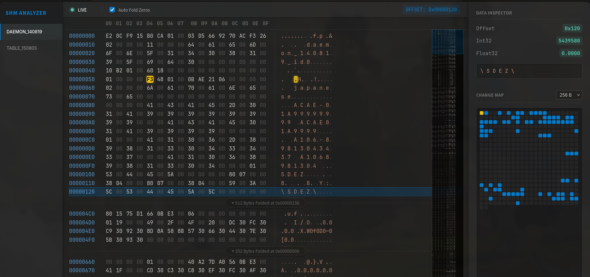

# Amdaemon SHM Analyzer
A shared memory analyzer

## Feature
 - WebUI
 - Real time updates
 - Automatically collapse empty areas
 - Change highlighting
 - NET 9.0

## How to use
1. Download and Run Amdaemon_SHM_Analyzer.exe from Release
2. Open http://your_ip:5000 in browser
3. Enjoy~
